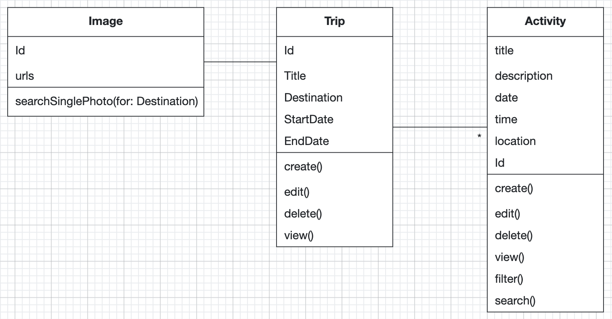

# Intro Course Project App of Raymond King Setia for the iPraktikum

To pass the intro course, you need to create your own unique iOS app (based on SwiftUI).

There are no requirements regarding the functions of your app, so you can get creative.
However, we provide you with Non-Functional Requirements (NFR) that your app needs to fulfill.

After each day of learning new Swift and SwiftUI concepts, these NFRs may change, or new NFRs get added.

## Submission procedure

You get a **personal repository** on Gitlab to work on your app.

Once you implemented a new feature into your app, you need to create a Merge Request (MR - Sometimes we will also reference these as "Pull Requests"(PR)) to merge your changes from the feature branch into your main branch.

Your tutor will review your changes and either request changes or approves the MR.

If your MR got approved, you also need to merge it!

### Deadline: **15.10.2024 23:59**

Until the deadline all of your PRs **need to be merged** and your final app **needs to fulfill** all of the requested NFRs!

---

## Problem Statement (max. 500 words)

Traveling can be an exciting yet overwhelming experience. Sometimes travelers lack the possibility to organize their vacation properly. Wouldn't it be nice if there was a dedicated app on your Iphone that lets you keep track of essential information such as landmarks, activities, dates, ticket purchases, and restaurant menus? Additionally, incorporating AI can significantly enhance the planning experience by generating personalized itineraries based on user preferences and estimating budgets.

## Requirements

- User can create, edit, delete, and view a trip
- User can create, edit, delete, and view an activity
- Activities can be filtered by name

## Analysis

## System Design

TODO: Include a system design overview describing your application.

## Product Backlog

TODO: Add a product backlog and don't forget to update it with each MR.

